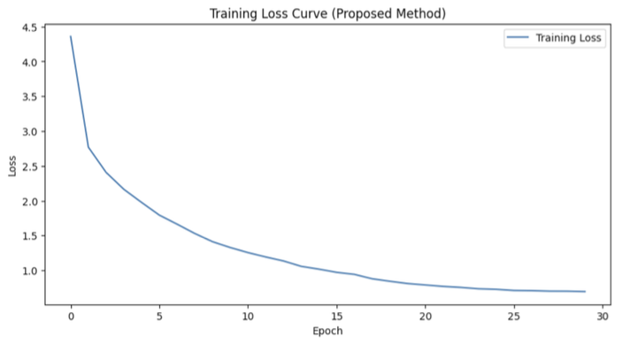
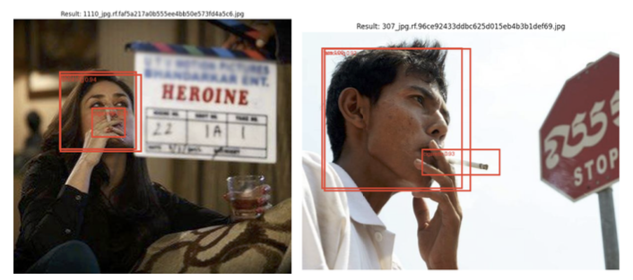
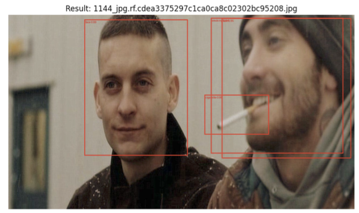

# 실시간 산불 예방을 위한 딥러닝 기반 흡연자 객체 검출 시스템
> **"대형 산불의 근본적 원인인 '입산자 실화'를 사전에 차단하기 위해, 경량 비전 모델(SSD)과 지하철/CCTV 환경에 최적화된 소형 객체 탐지 기법을 융합한 예방적 재난 대응 솔루션입니다."**

## 1. 프로젝트 개요
* **과목명**: 인공지능 (텀 프로젝트 #3)
* **목적**: 산림 및 금연 구역 내 CCTV 영상을 실시간 분석하여, 발화 전조가 되는 '흡연자(Smoker)' 및 '담배(Cigarette)' 객체를 정밀 탐지하는 조기 경보 시스템 구축
* **베이스 모델**: `SSD MobileNet V3 Large` (COCO Pre-trained)
* **데이터셋**: Roboflow 공개 데이터셋 2,364장 (COCO JSON 포맷)
* **핵심 성과**: 훈련 손실(Loss)을 초기 **4.35 ➔ 0.69로 감소**시키며 안정적 수렴 및 실시간 소형 객체 탐지 성공

---

## 2. 핵심 문제 해결 과정

광활한 야외 환경과 픽셀 크기가 극도로 작은 타겟(담배)을 실시간으로 포착하기 위해 심도 있는 최적화를 진행했습니다.

### Problem: 야외 조명 변화 및 극소형 객체(담배)의 오탐지 한계
* **상황**: 산림 내 CCTV 영상은 날씨와 시간대에 따른 조명 변화가 심하며, 화재의 직접적인 불씨가 되는 '담배(Cigarette)' 객체는 전체 영상 프레임 내에서 차지하는 픽셀 비중이 극도로 작아 모델이 이를 인식하지 못하거나 오탐지하는 문제가 발생했습니다.

### Action & Trade-off: 강건한 데이터 증강 전략 및 학습률 최적화
이를 해결하기 위해 인공지능 설계 가이드라인에 맞춘 트레이드오프와 최적화 전략을 실행했습니다.

1. **소형 객체 특화 데이터 증강(Augmentation) 도입**
   * **Color Jitter**: 밝기, 대비, 채도를 무작위 변조하여 다양한 기상 조건 및 야외 조명 변화에 강건(Robust)하도록 처리했습니다.
   * **Random Affine (회전/스케일 변환)**: 크기가 작고 형태가 단순한 담배 객체의 오탐지를 줄이기 위해 다양한 각도의 흡연 자세를 강제로 학습시켜 탐지 성능을 향상시켰습니다.

2. **경량 모델 선택 및 학습률 제어 (Trade-off: 모델 경량화 vs 탐지 정확도)**
   * **Trade-off 고민**: 탐지 정확도만을 높이기 위해 거대한 백본(예: Faster R-CNN)을 사용할 것인가, 아니면 실시간 서빙(Serving)을 위해 경량 모델을 택할 것인가를 조율했습니다.
   * **의사결정**: 산불 예방은 실시간 골든타임 확보가 핵심이므로 초당 프레임 수(FPS)를 보장할 수 있는 경량 모델인 `SSD MobileNet V3`를 전형적인 전이 학습(Transfer Learning) 구조로 설계했습니다. 대신 부족한 정확도는 **`Cosine Annealing LR Scheduler`**를 도입해 초반에는 빠르게 수렴하고 후반에는 미세 조정함으로써 가중치의 최적점(Global Minimum)을 안정적으로 찾도록 제어했습니다.

### Result: 정량적 & 정성적 성과 수치화
* **정량적 성과**: Epoch 10에서 Loss가 1.32로 급격히 수렴한 후, 최종 **Epoch 30에서 0.6946으로 안정적인 하향 수렴**을 달성했습니다.
* **정성적 성과**: Confidence Threshold 0.3, NMS(IoU=0.45) 조건 하에 추론을 수행한 결과, 얼굴(face)뿐만 아니라 극소형인 담배(cigarette)와 흡연 행위(smoking)를 정확히 바운딩 박스로 포착해내며 실전 조기 경보 시스템으로서의 높은 가능성을 입증했습니다.

---

## 3. 실험 결과 시각화

---

## 4. 회고 및 직무 적합성

* **비즈니스 관점의 AI 재정의**: 단순히 정확도 점수만 올리는 딥러닝이 아니라, "화재 발생 후의 사후 대응을 화재 이전의 원인 차단이라는 예방적 관점으로 전환"하는 비즈니스 도메인 중심의 AI 아키텍처 설계 능력을 길렀습니다.
* **실무 확장성**: 경량 모델 기반의 실시간 객체 탐지 기술은 대규모 서버 인프라뿐만 아니라 **산림 감시용 드론(Edge 장비) 및 실시간 온디바이스 AI(On-Device AI) 환경에도 가볍게 이식되어 운영 비용을 획기적으로 낮출 수 있는 재사용성 높은 자산**이 될 것입니다.

